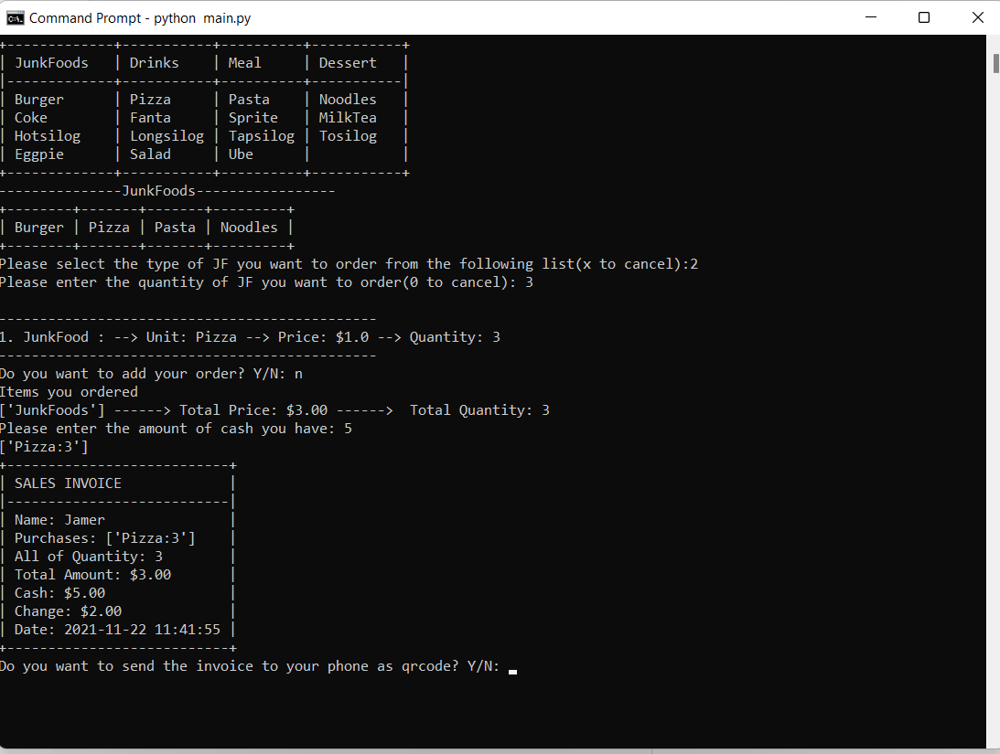

<p align="center">
  <a href="https://avatars.githubusercontent.com/u/90885275?s=400&u=1689d81422a96c1d35abd891ea795b3ea566b0c4&v=4e">
    
  </a>

  <h3 align="center">TECHSQUAD TEAM</h3>

  <p align="center">
    <br>
    <a href="https://github.com/IT-TECH-SQUAD/Case-Study/issues">Report bug</a>
    ·
  </p>
</p>


## Table of contents

- [Quick start](#quick-start)
- [What's included](#whats-included)
- [Creators](#creators)
- [Outline](#outline)
- [Library Used](#library-used)

- - -

## Quick start

# J05-Team-POS

- How to install and execute?

```
    git clone https://github.com/IT-TECH-SQUAD/Case-Study
    cd Case-Study
    pip install -r requirements.txt
    python main.py
    
```
- - -
- Requirements

**WhatsApp Contact Number**
- - -

## Outline 

## User Interface


- - -

## Starting point
- It needs your couple credentials and the contact number input session is hidden(sensitive mode)


- - -

## Order proceedure
- The ordering process is a one time procedure if you chose specific category the program could not get back to the main menu

- - -

## Receipt info
- You can recieve your receipt via whatsapp and see all the info you've done 

- - -

## What's included

```Food Category by [Unit]
── Units
   ├── Dessert
   │   ├── Eggpie
   │   ├── Salad
   │   └── Ube
   ├── Drinks
   │   ├── MilkTea
   │   ├── Sprite
   │   ├── Fanta
   │   └── Coke
   ├── JunkFoods
   │   ├── Burger
   │   ├── Pasta
   │   ├── Pizza
   │   └── Noodles
   └── Meal
       ├── Hotsilog
       ├── Longsilog
       ├── Topsilog
       └── Tosilog
```
- - -

## Library used

**pywhatkit == 5.2  [pywhatkit from pypi ](https://pypi.org/project/pywhatkit/)**
- - -

**tabulate == 0.8.9 [tabulate from pypi ](https://pypi.org/project/tabulate/)**
- - -

**Pillow == 8.4.0   [Pillow from pypi ](https://pypi.org/project/Pillow/)**
- - -

**getpass3 == 1.2   [getpass3 from pypi ](https://pypi.org/project/getpass3/)**
- - -

**termcolor2 == 0.0.3 [tercolor2 from pypi ](https://pypi.org/project/termcolor2/)***
- - -

**pypng == 0.0.21 [tercolor2 from pypi ](https://pypi.org/project/pypng/)***
- - -

**pyqrcode == 1.2.1 [tercolor2 from pypi ](https://pypi.org/project/pyqrcode/)***
- - -


## Creators

**Hemerson G. Ramiro Jr.**

- <https://www.jamer05.me>
- - -
### Donate!
Support the authors:

<noscript><a href="https://www.paypal.com/donate/?hosted_button_id=RRBSABBYCBW4L"></a></noscript>
